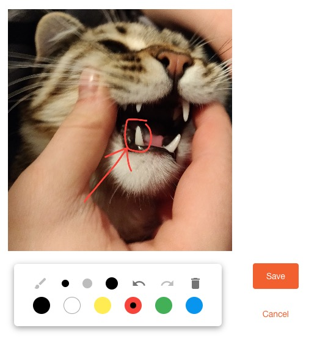

# Ngx Image Drawing



> Ps. No animals were harmed in taking this picture :P

## Description

This module allow to draw on pictures and export the result. (Uses `canvas` & `fabric.js`)

## Installation

`npm install --save ngx-image-drawing`

## Usage

Add the ImageDrawingModule to the imports of the module which will be using the drawing module.
```ts
import { NgModule } from '@angular/core';
import { ImageDrawingModule } from 'ngx-image-drawing';

@NgModule({
    imports: [
        ...
        ImageDrawingModule
    ],
    declarations: [
        ...
    ],
    exports: [
        ...
    ],
    providers: [
        ...
    ]
})
export class YourModule {
}
```

You can now use in a component like so
```html
<image-drawing
    [src]="imageUrl"
    saveBtnText="Save"
    cancelBtnText="Cancel"
    outputMimeType="'image/jpeg'"
    outputQuality="0.8"
    (save)="save($event)"
    (cancel)="cancel()">
</image-drawing>
```

### Inputs

- `src: string` : Image url
- `saveBtnText: string?` : Save button text (default value : 'Save' )
- `cancelBtnText: string?` : Cancel button text (default value : 'Cancel')
- `loadingText: string?` : Image loading text (default value : 'Loading…')
- `errorText:  string?` : Image loading error text (default value : 'Error loading %@', where `%@` is replaced by the `src`)
- `outputMimeType: string?` : Mime Type of the output image, can be `image/png`, `image/jpeg` or `image/webp`
- `outputQuality: number?`: Number between 0 and 1 to determine the quality of the ouput image (if mimeType is jpeg or webp)
- `loadingTemplate: TemplateRef<any>?` : Image loading template
- `errorTemplate: TemplateRef<any>?` : Image loading error template
- `imageScale: number?` : Scale the image (default value: `1.0`) (values > 1 increases the rendered image)
- `enableTooltip: boolean?` : Enable / disable tooltip for toolbar buttons/actions (default value: `true`)
- `tooltipLanguage: string?` : Language of tooltip (`en` or `fr`) (default value: `en`)


### Actions
- `save` - Action on save button click, use `$event` to get the new edited image
- `cancel` - Action on cancel button click

## Maintainers

- [@the0neyouseek](https://github.com/the0neyouseek)

## Contributors

- [@bambidotexe](https://github.com/bambidotexe)
- [@neelavar](https://github.com/neelavar)
- [@valentintintin](https://github.com/valentintintin)
